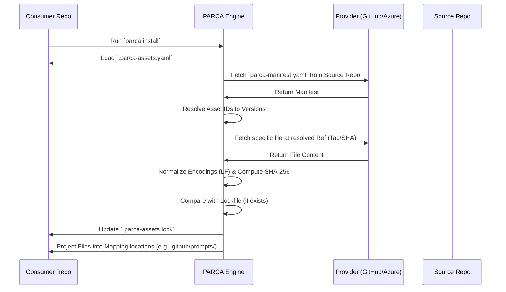

# PARCA v0.0.1: Formal Specification

PARCA (Protocol of Asset Resolution for Coding Agents) is a decentralized standard for distributing, versioning, and consuming agentic assets (prompts, skills, instructions).

## 1. Actors

| Actor | Responsibility |
| :--- | :--- |
| **Maintainer** | Publishes assets to a **Source Repository** (hosting the `parca-manifest.yaml`). |
| **Consumer** | Developers using assets in their projects via `.parca-assets.yaml`. |
| **Source Repository** | A Git-based host containing the asset files and the manifest. |
| **Provider** | The hosting service (GitHub, Azure DevOps) providing API/Git access. |
| **PARCA Engine** | The CLI/Extension used by the **Consumer** to resolve, fetch, and verify assets. |
| **Coding Agent** | The AI assistant (Copilot, Cursor, etc.) that consumes the projected files. |

## 2. Technical Specification

### 2.1 The Manifest (`parca-manifest.yaml`)
Located at the root of the Source Repository.

```yaml
schema: 1.0
# Define how versions match Git refs (tags/branches)
version-strategy:
  template: "v{{version}}" # Optional. If omitted, Engine defaults to the manifest's revision.

assets:
  <asset-id>:
    kind: prompt | skill | instruction
    description: "Brief description"
    versions:
      <version-string>:
        path: "path/to/file.md"
        ref: "v1.0.0" # Optional. Overrides the version-strategy if present.
        runtime: # Optional
          llm: [{ provider: "openai", models: ["gpt-4o"] }]
```

### 2.2 The Configuration (`.parca-assets.yaml`)
Located at the root of the Consumer Repository.

```yaml
schema: 1.0
sources:
  my-org: # The 'source-alias'
    type: git
    provider: github
    url: "https://github.com/my-org/agent-assets"
assets:
  - id: refactor-logic # The unique ID within the source manifest
    source: my-org      # References the alias above
    version: "1.2.0"
    mapping: ".github/prompts/refactor.md"
```

### 2.3 CLI & Configuration Philosophy
The PARCA Engine is designed to manage `.parca-assets.yaml` automatically. Users should generally not edit the YAML manually for installation tasks.

*   **Discovery**: `parca list-remote <url>` allows browsing a source before committing to it.
*   **Installation**: `parca install <url> <asset-id>` performs the complete end-to-end flow: source registration + asset entry + file resolution.
*   **Resolution**: Installation always triggers a recursive `resolve` operation to ensure workspace consistency.

### 2.3 The Lockfile (`.parca-assets.lock`)
Ensures reproducibility and security.

```json
{
  "assets": [
    {
      "id": "refactor-logic",
      "version": "1.2.0",
      "source": "my-org",
      "commit": "abc12345",
      "sha256": "hash_of_content",
      "manifestHash": "hash_of_manifest_at_time_of_resolution"
    }
  ]
}
```

## 3. The Resolution Flow (Deterministic)



## 4. Workspace Projection (Symlinks)

To support integration with existing IDE assistants (which scan `.github/prompts/` etc.):

1.  **Central Cache**: All assets are downloaded to a machine-wide cache (e.g., `~/.parca-cache/`).
2.  **Workspace Symlinking**: The Engine creates a **symbolic link** directly from the Central Cache to the location specified in `.parca-assets.yaml` (e.g., `.github/prompts/my-asset.md`).
3.  **No Redundancy**: This avoids duplicating files in every project and ensures the assistant always sees the versioned content.
4.  **Automatic Ignoring**: The Engine automatically manages the `.gitignore` file to ensure symlinked assets are not committed to the Consumer Repository.

## 6. Maintainer Workflow (Publishing)

The PARCA protocol minimizes "Tag Fatigue" for maintainers by using the **Dynamic Registry** model.

### 6.1 The "Manual" Publish
1.  **Edit**: Maintainer updates the asset file (e.g., `prompts/sql-expert.md`).
2.  **Declare**: Maintainer adds a new entry to `parca-manifest.yaml` with an incremented version number.
3.  **Push**: Maintainer commits and pushes to `main`.
4.  **Result**: The version is now "Live". Consumers who run `parca resolve` or `parca install` will find this version on the `main` branch manifest.

### 6.2 The "Assisted" Publish (Phase 2 Focus)
The PARCA VS Code Extension will provide a `Publish Asset` command that:
1.  Validates the asset file.
2.  Auto-increments the version in the manifest.
3.  Calculates the local SHA-256 for dry-run verification.
4.  Updates the YAML and stages the files for commit.

### 6.3 Immutability Guarantee
Even without Git tags, **Consumers** are safe. 
- When a consumer installs a version, the PARCA Engine resolves the *current* `main` branch to a specific **Commit SHA**.
- This SHA is recorded in the consumer's `.parca-assets.lock`.
- Future updates to the source `main` branch will **not** affect existing consumer projects until they explicitly "upgrade" their version or refresh their lockfile.
